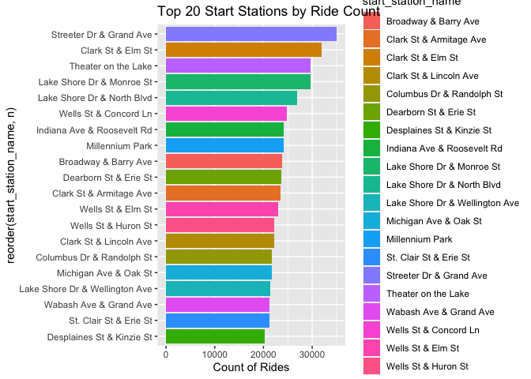

Bike Share Exploration
================
Partha Sarker
2023-02-13

``` r
#load packages
library(tidyverse)
```

    ## ── Attaching packages ─────────────────────────────────────── tidyverse 1.3.2 ──
    ## ✔ ggplot2 3.4.1     ✔ purrr   1.0.1
    ## ✔ tibble  3.1.8     ✔ dplyr   1.1.0
    ## ✔ tidyr   1.3.0     ✔ stringr 1.5.0
    ## ✔ readr   2.1.4     ✔ forcats 1.0.0
    ## ── Conflicts ────────────────────────────────────────── tidyverse_conflicts() ──
    ## ✖ dplyr::filter() masks stats::filter()
    ## ✖ dplyr::lag()    masks stats::lag()

``` r
library(janitor)
```

    ## 
    ## Attaching package: 'janitor'
    ## 
    ## The following objects are masked from 'package:stats':
    ## 
    ##     chisq.test, fisher.test

``` r
library(lubridate)
```

    ## 
    ## Attaching package: 'lubridate'
    ## 
    ## The following objects are masked from 'package:base':
    ## 
    ##     date, intersect, setdiff, union

``` r
#import data
df1 <- read.csv("/Users/partha/Documents/R/Bike Share Case Study/t1.csv")
df2 <- read.csv("/Users/partha/Documents/R/Bike Share Case Study/t2.csv")
df3 <- read.csv("/Users/partha/Documents/R/Bike Share Case Study/t3.csv")
df4 <- read.csv("/Users/partha/Documents/R/Bike Share Case Study/t4.csv")
df5 <- read.csv("/Users/partha/Documents/R/Bike Share Case Study/t5.csv")
df6 <- read.csv("/Users/partha/Documents/R/Bike Share Case Study/t6.csv")
df7 <- read.csv("/Users/partha/Documents/R/Bike Share Case Study/t7.csv")
df8 <- read.csv("/Users/partha/Documents/R/Bike Share Case Study/t8.csv")
df9 <- read.csv("/Users/partha/Documents/R/Bike Share Case Study/t9.csv")
df10 <- read.csv("/Users/partha/Documents/R/Bike Share Case Study/t10.csv")
df11 <- read.csv("/Users/partha/Documents/R/Bike Share Case Study/t11.csv")
df12 <- read.csv("/Users/partha/Documents/R/Bike Share Case Study/t12.csv")
```

``` r
##
## combine 12 data. frames into one (1) data frame
##
bike_rides <- rbind(df1,df2,df3,df4,df5,df6,df7,df8,df9,df10,df11,df12)
bike_rides <- janitor::remove_empty(bike_rides,which = c("cols"))
bike_rides <- janitor::remove_empty(bike_rides, which = c("rows"))

## remove na values
bike_rides <- replace(bike_rides, bike_rides=='', NA)
sum(is.na(bike_rides))
```

    ## [1] 541397

``` r
bike_rides <- na.omit(bike_rides)
# above ok - do not delete
```

### comment out

## Filtering starting stations with blank names

bike_rides_start_blank \<- bike_rides %\>% filter (start_station_name
==““) %\>% group_by(ride_id, rideable_type, started_at, ended_at,
start_station_name, start_station_id, end_station_name, end_station_id,
start_lat, start_lng, end_lng, member_casual) %\>% summarise(n=n())

## Filtering starting stations without blank names

bike_rides_start_non_blank \<- bike_rides %\>% filter
(start_station_name !=““) %\>% group_by(ride_id, rideable_type,
started_at, ended_at, start_station_name, start_station_id,
end_station_name, end_station_id, start_lat, start_lng, end_lng,
member_casual) %\>% summarise(n=n())

## \#Filtering ending stations with blank names

bike_rides_end_blank \<- bike_rides %\>% filter (end_station_name ==““)
%\>% group_by(ride_id, rideable_type, started_at, ended_at,
start_station_name, start_station_id, end_station_name, end_station_id,
start_lat, start_lng, end_lng, member_casual) %\>% summarise(n=n())

## \#Filtering ending stations without blank names

bike_rides_end_non_blank \<- bike_rides %\>% filter (end_station_name
!=““) %\>% group_by(ride_id, rideable_type, started_at, ended_at,
start_station_name, start_station_id, end_station_name, end_station_id,
start_lat, start_lng, end_lng, member_casual) %\>% summarise(n=n())

\###below chunk necessary? \#merging both start station names start_data
\<- data.frame(bike_rides_start_non_blank) start_data \<-
rbind(start_data,bike_rides_start_blank)

\#merging both end station names end_data \<-
data.frame(bike_rides_end_non_blank) end_data \<-
rbind(end_data,bike_rides_end_blank)

### comment out

### comment out

\#Merging start and end dfs bike_rides2 \<-
merge(bike_rides_start_non_blank, bike_rides_end_non_blank, by =
“ride_id”) \### comment out

``` r
##
##Convert Date/Time stamp to Date/Time ...
##
bike_rides$Ymd <- as.Date(bike_rides$started_at)
bike_rides$started_at <- 
  lubridate::ymd_hms(bike_rides$started_at)
bike_rides$ended_at <-
  lubridate::ymd_hms(bike_rides$ended_at)

bike_rides$start_hour <-
  lubridate::hour(bike_rides$started_at)
bike_rides$end_hour <- lubridate::hour(bike_rides$ended_at)
```

``` r
##
##Calculate duration and remove rows with "0" time
##Removed null values from "df"
##
bike_rides$Hours <-
  difftime(bike_rides$ended_at,bike_rides$started_at,units= 
             c("hours"))

bike_rides$Minutes <-
  difftime(bike_rides$ended_at,bike_rides$started_at,units= 
             c("mins"))

df <- bike_rides %>% filter(Hours >0) %>% drop_na() %>%
  select(-ride_id,-end_station_name, -end_station_id,
         -end_station_name)
#fewer obs in "df" data frame - by removing rows with "0" time
#select function to choose only columns of interest
```

Data Log:

10,552 rows with negative trip durations 122,175 rows with missing
Starting station names (and ID) Up to 1291 stations with two different
station_ID Advised by Manager – ok to ignore rows with trip duration
\<=0 Therefore – we can ignore rows with missing start station_name, and
also ignore station_ID. And should focus on using the
“start_station_name to perform aggregate functions on date,
start_station_name, member_casual and rideable_type

Cleaning reduced the data to 3,354,514 obs from an original or 3,489,748
obs

``` r
### Create summary data frame

bikesrides2 <- bike_rides %>% group_by(Weekly =
  floor_date(Ymd,"week"),start_hour) %>%
  summarise(
    Minutes = sum(Minutes),
    Mean = sum(Minutes),
    Median = median(Minutes),
    Max = max(Minutes),
    Count = n()
  ) %>% ungroup()
```

    ## `summarise()` has grouped output by 'Weekly'. You can override using the
    ## `.groups` argument.

\##Plot of Rides By Date \#### Summary Stats: Counts

``` r
# Summary of Hourly Counts
summary(bikesrides2$Count)
```

    ##    Min. 1st Qu.  Median    Mean 3rd Qu.    Max. 
    ##       2     377    1430    2600    3676   15422

- Count of rides by Hour

``` r
# Table of Counts by Hour
xtabs(bikesrides2$Count~bikesrides2$start_hour)
```

    ## bikesrides2$start_hour
    ##      0      1      2      3      4      5      6      7      8      9     10 
    ##  31812  19113  10361   5790   6344  21432  66371 112645 128192 121084 142786 
    ##     11     12     13     14     15     16     17     18     19     20     21 
    ## 186117 221751 229084 235056 255141 290844 338643 299067 215958 139819  90917 
    ##     22     23 
    ##  72255  54109

``` r
bikesrides2$Monthly <- lubridate::month(bikesrides2$Weekly)

bikesrides2 %>% ggplot() + geom_col(aes(x=Weekly,y=Count,fill=Count)) +
  scale_y_continuous(labels = ,) +
  labs(title = "Count of Rides per Day",
       subtitle = "(Bases on 28 day moving average",
       y = "Average rides per day")
```

<!-- -->

``` r
options(scipen = 999)
bikesrides2 %>% ggplot() + geom_col(aes(x=start_hour,y=Count, fill=Count)) +
  scale_y_continuous(labels = ,) +
  labs(title = "Count of Rides by Hours",
       y = "Rides per Hour")
```

<!-- -->

``` r
### Create summary bikestype data frame
bikestype <- bike_rides %>% group_by(member_casual,rideable_type,Weekly =
  floor_date(Ymd,"week")) %>%
  summarise(
    Minutes = sum(Minutes),
    Mean = sum(Minutes),
    Median = median(Minutes),
    Max = max(Minutes),
    Count = n()
  ) %>% ungroup()
```

    ## `summarise()` has grouped output by 'member_casual', 'rideable_type'. You can
    ## override using the `.groups` argument.

- Count by Bike Type(Total per week)

``` r
ggplot(bikestype) +
  geom_area(aes(x=Weekly,y=Count,fill=rideable_type)) +
  scale_y_continuous(labels = ,) +
  labs(title = "Count of ride by Bike Type",subtitle = "(for 12 months ending 31-03-2021)")
```

<!-- -->

- Total Ride Minutes by week

``` r
ggplot(bikestype) + 
  geom_col(aes(x = Weekly,y = Count, fill=member_casual)) +
  scale_y_continuous(labels = ,) +
  labs(title = "Total Ride Minutes by Rider Type")
```

<!-- -->

``` r
bike_rides %>%
  count(start_station_name,sort = TRUE) %>%
  top_n(20) %>% ggplot() +
  geom_col(aes(x=reorder(start_station_name,n),y=n, fill=start_station_name)) +
  coord_flip() +
  labs(title = "Top 20 Start Stations by Ride Count", y="Count of Rides") +
  scale_y_continuous(labels=,)
```

    ## Selecting by n

<!-- -->

``` r
# Top 20 start stations for casual riders
bike_rides %>% 
  group_by(start_station_name, member_casual) %>% 
  summarize(number_of_rides = n(), .groups = 'drop') %>% 
  filter(start_station_name != "", member_casual != "member") %>% 
  arrange(-number_of_rides) %>% 
  head(n=20)
```

    ## # A tibble: 20 × 3
    ##    start_station_name           member_casual number_of_rides
    ##    <chr>                        <chr>                   <int>
    ##  1 Streeter Dr & Grand Ave      casual                  26049
    ##  2 Lake Shore Dr & Monroe St    casual                  20524
    ##  3 Millennium Park              casual                  19283
    ##  4 Theater on the Lake          casual                  14939
    ##  5 Michigan Ave & Oak St        casual                  13539
    ##  6 Indiana Ave & Roosevelt Rd   casual                  13522
    ##  7 Lake Shore Dr & North Blvd   casual                  13248
    ##  8 Clark St & Elm St            casual                  11862
    ##  9 Michigan Ave & Lake St       casual                  11622
    ## 10 Michigan Ave & Washington St casual                  10595
    ## 11 Clark St & Lincoln Ave       casual                  10088
    ## 12 Buckingham Fountain          casual                   9980
    ## 13 Wells St & Concord Ln        casual                   9919
    ## 14 Clark St & Armitage Ave      casual                   9769
    ## 15 Shedd Aquarium               casual                   9748
    ## 16 Wabash Ave & Grand Ave       casual                   9668
    ## 17 Michigan Ave & 8th St        casual                   9649
    ## 18 Columbus Dr & Randolph St    casual                   9350
    ## 19 Wells St & Elm St            casual                   9110
    ## 20 Fairbanks Ct & Grand Ave     casual                   8949

KEY FINDINGS

- There are more casual riders on weekends than week days.
- During the summer months the number of casual riders steadily increase
  between the months of June to August
- Docked bikes are the most popular and classic bikes are the least
  popular
- Between 3 PM to 6 PM is the peak time with highest number of rides
  during the day
- The mean ride length of casual riders is two times longer than members
- The top 3 start stations for casual riders are 1. Streeter Dr. & Grand
  Ave. 2. Lake Shore Dr.& Monroe St. and 3. Millennium Park

Recommendations:

- Offer attractive discount on memberships during summer months and
  especially weekends to attract casual riders.
- Marketing campaigns targeting top stations used by casual riders may
  increase the rate of subscription.
- Form partnership with local businesses around the top 10 stations used
  by casual riders.
- Carryout marketing campaigns on digital media, cycling apps,
  billboards and local businesses on key cycling routes.
